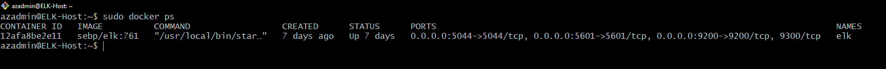

## Automated ELK Stack Deployment

The files in this repository were used to configure the network depicted below.

These files have been tested and used to generate a live ELK deployment on Azure. They can be used to either recreate the entire deployment pictured above. Alternatively, select portions of the playbook files may be used to install only certain pieces of it, such as Filebeat.

  - _filebeat-playbook.yml_
  - _metricbeat-playbook.yml_

This document contains the following details:
- Description of the Topology
- Access Policies
- ELK Configuration
  - Beats in Use
  - Machines Being Monitored
- How to Use the Ansible Build

### Description of the Topology

The main purpose of this network is to expose a load-balanced and monitored instance of DVWA, the D*mn Vulnerable Web Application.

Load balancing ensures that the application will be highly available, in addition to restricting traffic to the network.

Integrating an ELK server allows users to easily monitor the vulnerable VMs for changes to the system files and system metrics.

The configuration details of each machine may be found below.

| Name                | Function               | IP Address | Operating System |
|---------------------|------------------------|------------|------------------|
| JumpBox-Provisioner | Gateway                | 10.1.0.7   | Linux            |
| ELK Host            | Hosting the ELK Server | 10.2.0.4   | Linux            |
| Web-1               | Hosting DVWA           | 10.1.0.8   | Linux            |
| Web-2               | Hosting DVWA           | 10.1.0.9   | Linux            |

### Access Policies

The machines on the internal network are not exposed to the public Internet. 

Only the ELK Host machine can accept connections from the Internet. Access to this machine is only allowed from the following IP addresses:
- 76.68.45.226

Machines within the network can only be accessed by SSH.
- Jumpbox Provisioner

A summary of the access policies in place can be found in the table below.

| Name                | Publicly Accessible | Allowed IP Addresses |
|---------------------|---------------------|----------------------|
| JumpBox-Provisioner | No                  | 76.68.45.226         |
| ELK Host            | Yes                 | 76.68.45.226         |
| Web VMs             | No                  | 10.1.0.7 10.2.0.4    |

### Elk Configuration

Ansible was used to automate configuration of the ELK machine. No configuration was performed manually, which is advantageous because if the need arises for more Web-VMs to be setup the process to get them up and running will be quicker and easier.

The playbook implements the following tasks:
- Install docker.io
- Install docker module
- Download and launch ELK container

The following screenshot displays the result of running `docker ps` after successfully configuring the ELK instance.

**Note**: The following image link needs to be updated. Replace `docker_ps_output.png` with the name of your screenshot image file.  

### Target Machines & Beats
This ELK server is configured to monitor the following machines:
- Web-1: 10.1.0.8
- Web-2: 10.1.0.9

We have installed the following Beats on these machines:
- Filebeat
- Metricbeat

These Beats allow us to collect the following information from each machine:
- Filebeat collects file information, we expect to receive information regarding system logs for example.
- Metricbeat collects system metric information, we expect to receive information regarding CPU or RAM usage for example.
- 
### Using the Playbook
In order to use the playbook, you will need to have an Ansible control node already configured. Assuming you have such a control node provisioned: 

SSH into the control node and follow the steps below:
- Copy the YAML playbook files to the `etc/ansible/` folder.
- Update the hosts file to include the differnet machines and their IPs. Web VMs and their IPs, the ELK host and it's IP.
- Run the playbook, and navigate to 13.66.161.54:5601 to check that the installation worked as expected.
